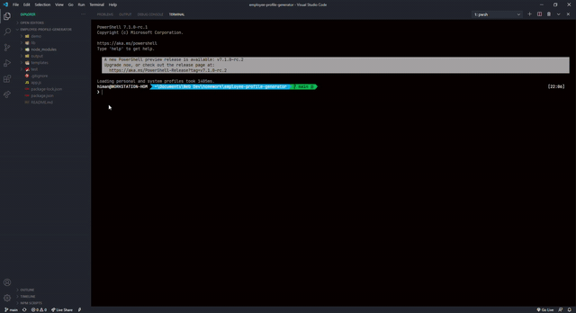

# Employee-Profile-Generator

A Node.js CLI application that takes user input about their employees and generates an HTML webpage to display profiles for each employee.

## Table of Contents

  - [Installation](#installation)
  - [Usage](#usage)
  - [License](#license)
  - [Developer Info](#developer-info)

## Installation

To generate your own employee roster, first run `npm install` in order to install the npm package dependencies as specified in the `package.json`

The application itself can be invoked with `node app.js`.

## Usage 

When you run `node app.js`, the application uses the `inquirer` package to prompt the user  with a series of questions about employer data.

The application then takes the responses and allows the user to categorize the employees as Manager, Engineer or Intern.
Each category has their specific attributes, with some common emplyee data types as: name, id & email.
It will then generate render a HTML file using the render function in `./lib/htmlRenderer.js`.

Finally, `fs.writeFile` is used to generate the HTML file.

## License

MIT License

---
## Developer Info

 Feel free to contact me with any questions:

GitHub: [@himanshu-sxna](https://github.com/himanshu-sxna)

Email: contact@hellohimanshu.com